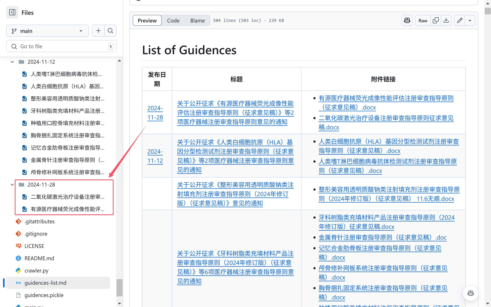

# Guidelines

本仓库收集来自国家药品监督管理局医疗器械技术审评中心发布的指导原则（含征求意见稿）。

你可以前往 [List of Guidences](guidences-list.md) 查询。



## Usage

1. Clone this repository

   ```bash
   git clone https://github.com/Snoopy1866/guidelines-crawler.git
   ```

2. Install requirements

   ```bash
   pip install -r requirements.txt
   ```

3. Run crawler

   ```bash
   python -m crawler --page 0
   ```

> [!TIP]
>
> If you want to crawler page _x_, just pass the _--page_ argument.
> For example, if you want to crawl from https://www.cmde.org.cn/flfg/zdyz/index_8.html, run `python -m crawler --page 8`.

## Pickle 文件

[guidences.pickle](guidences.pickle) 文件是一个持久化的 `GuidencePublishPage` 列表，你可以使用 Python 的内置库 [pickle](https://docs.python.org/3/library/pickle.html) 查看具体数据。

`GuidencePublishPage` 的定义如下：

```python
@dataclass
class GuidencePublishPage:
    title: str # 指导原则发布页标题
    url: str # 指导原则发布页链接
    date: datetime.date #指导原则发布页日期
    accessories: list[Accessory] #指导原则发布页附件，一个 `Accessory` 列表

@dataclass
class Accessory:
    anchor_title: str #附件标题
    anchor_href: str #附件链接
    anchor_content: str #备选标题 1
    content: str #备选标题 2
    anchor_text_value: str #备选标题 3
```

## 声明

本仓库 [guidences](./guidences/) 目录下的所有文件均为官方公开发布的文件，仅供学习和参考之用。本仓库不对这些文件的准确性、完整性或适用性做任何保证或承担任何责任。使用者应自行核实相关信息，并对使用本仓库内容所产生的任何后果负责。
